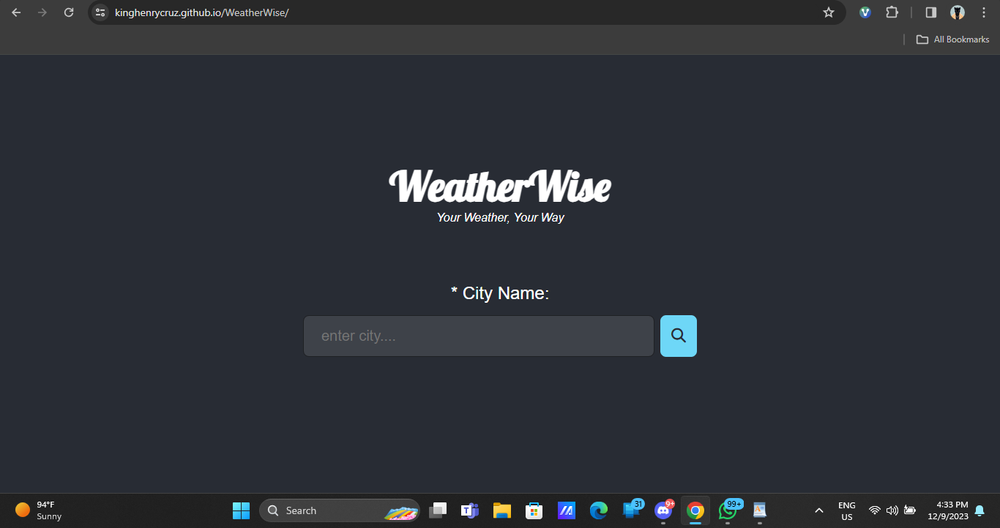

# WeatherWise

## Introduction

WeatherWise is a weather information application that provides real-time weather updates for cities around the world. This project was developed as a part of the Holberton School portfolio.

- [Deployed Site](#) 
- [Final Project Blog Article](#) https://www.linkedin.com/pulse/weatherwise-your-weather-way-kinghenry-ize-nz4sf
- Author(s): [KingHenry D' Great](#) https://www.linkedin.com/in/kinghenrycruz

## Installation

To run WeatherWise locally, follow these steps:

1. Clone the repository:
   ```bash
   git clone https://github.com/YourUsername/WeatherWise.git

2. Navigate to the project directory: cd WeatherWise
3. Install dependencies: npm install
4. Set up environment variables: 
    ``` Create a .env file in the root directory.
    Add your OpenWeatherMap API key: API_KEY=your_openweathermap_api_key

## Usage
1. Start the application:
2. Open your browser and go to http://localhost:3000.
3. Enter the city name in the provided form and click on the "search icon" to get weather information.

## Contributing
If you'd like to contribute to WeatherWise, please follow these steps:

1. Fork the repository.
2. Create a new branch: `git checkout -b feature/new-feature`.
3. Commit your changes: `git commit -m 'Add new feature'`.
4. Push to the branch: `git push origin feature/new-feature`.
5. Submit a pull request.

## Screenshot of WeatherWise

